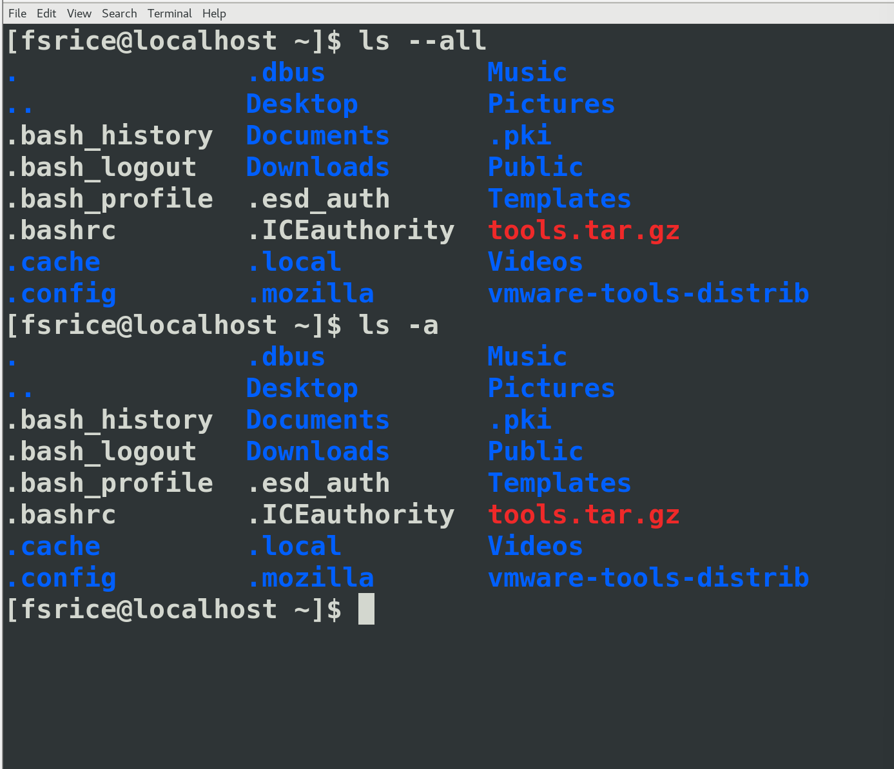

###### ls

> ls是list的缩写
>
> 用于列出当前目录的文件和目录
>
> ###### 
>
> 例如**ls -a**就表示输出所有的文件（短参数）
>
> > 其中a表示all的意思
>
> 
>
> 会列出隐藏的文件
>
> **ls --all**长参数
>
> 

###### history

> 返回之前使用过的全部命令
>
> 
>
> ** 可以使用 *!编号*的方式重新运行命令
>
> 

###### date

> 返回当前时间
>
> 

###### whoami

> 返回当前用户的用户名
>
> 
