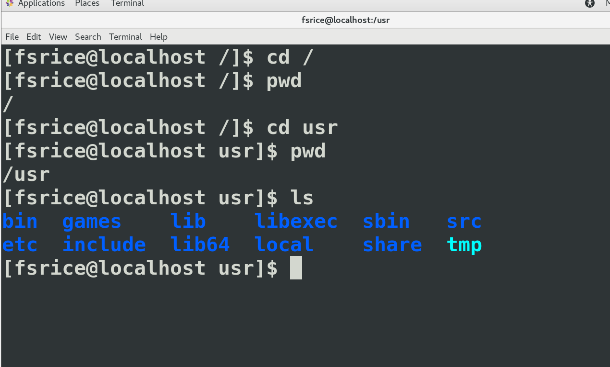
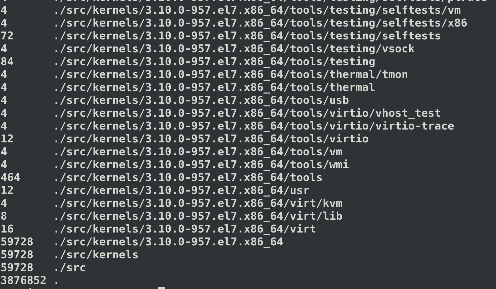
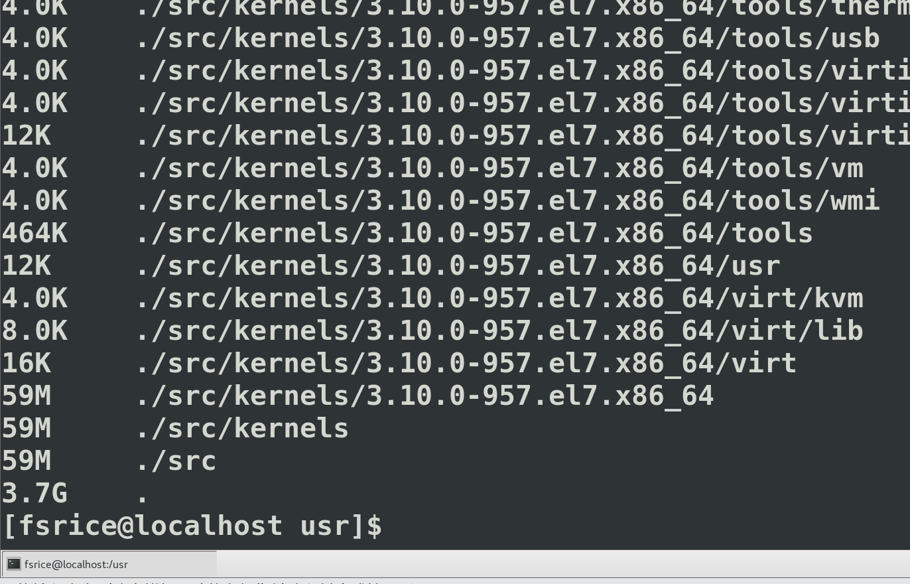
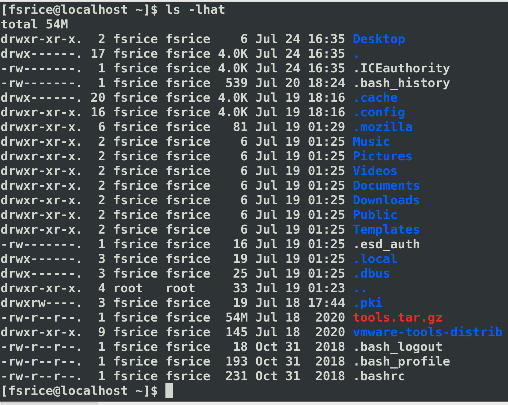
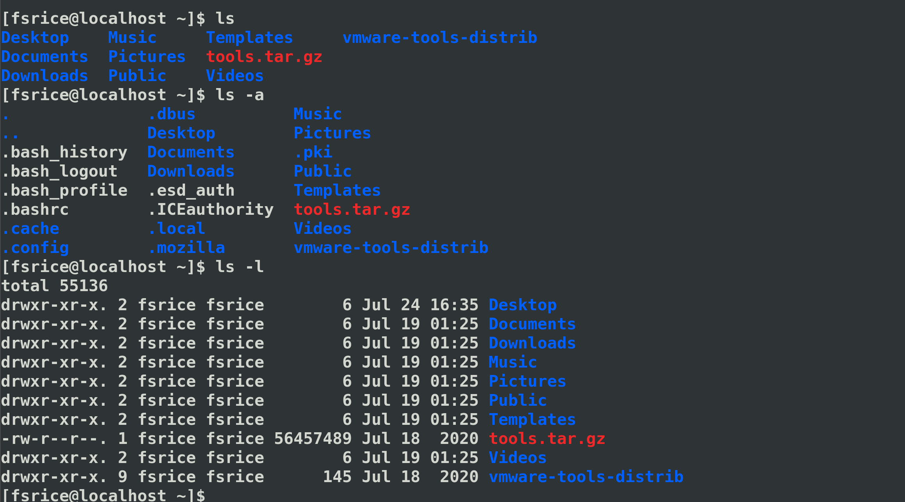
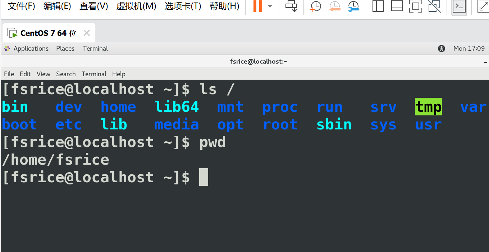
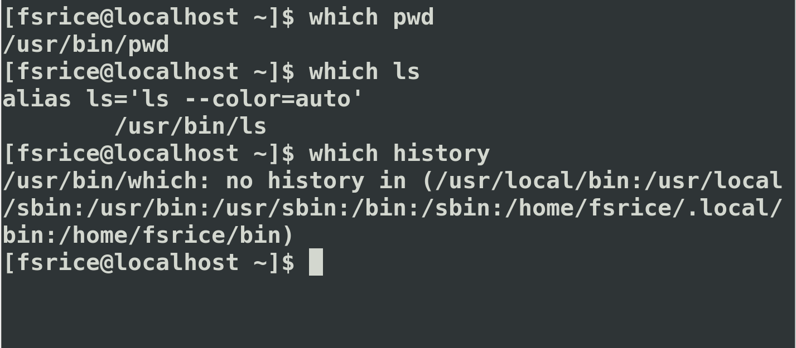
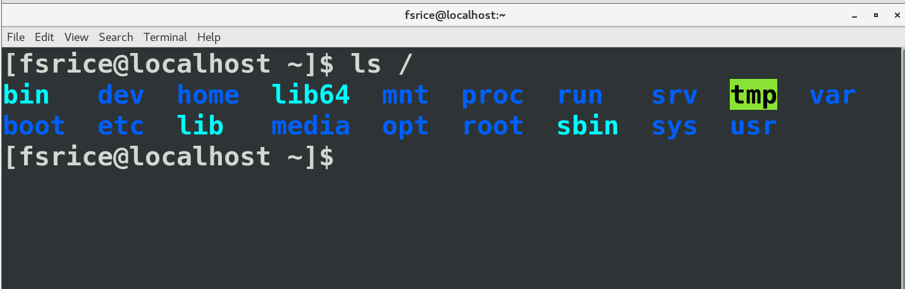

###### cd

> change directory切换目录
>
> 参数： 路径
>
> 
>
> cd ..
>
> > 返回上一级目录
>
> cd .
>
> > 进入当前目录
>
> cd ~
>
> > 直接进入home目录
>
> cd
>
> > 也是直接进入home目录

###### du

> disk usage磁盘占用
>
> **du**
>
> 
>
> -a 显示目录和文件大小（默认du仅显示目录大小）
>
> -h 以KB、MB、GB的形式显示文件大小
>
> 

###### ls

> 列出所有文件和目录
>
> > **ls常用的参数**
> >
> > *ls常用参数中的参数可以混合使用*
> >
> > *例如当使用MB为单位、显示所有文件信息、按修改时间排序可以使用 ls -lath*
> >
> > 
> >
> > 1. **-a**
> >
> > > 在Linux中，以 . 开头的文件为隐藏文件，一般不予显示
> > >
> > > 使用给参数可以列出所有的文件
> >
> > 2. **-l**
> >
> > > 可以列出每一个显示文件和目录的详细信息的列表
> > >
> > > 每一个文件或目录都会有一行对应的信息
> > >
> > > 
> > >
> > > *从左到右依次为*
> > >
> > > > 1.*文件权限*
> > > >
> > > > 2.*连接数目*
> > > >
> > > > 3.*文件所有者名称*
> > > >
> > > > 4.*文件所在群组*
> > > >
> > > > 5.*文件大小*
> > > >
> > > > 6.*修改日期*
> > > >
> > > > 7.*文件或目录的名称*
> >
> > 3. **-h**
> >
> > > ls -l列出的文件详细信息中，文件大小是以字节为单位的
> > >
> > > 参数-h可以以KB、MB、GB的形式显示文件大小
> >
> > 4. **-t**
> >
> > > 可以按修改时间对文件进行排序

###### pwd

> Print Working Directory
>
> 输入*pwd*会返回当前所在目录
>
> 

###### which

> Linux下每个命令对应一个可执行文件的位置
>
> which命令可以返回一个命令的可执行文件的位置
>
> 

Linux有且只有一个根目录

使用 / 来表示包含关系

**使用 ls / 列出根目录下所有目录**

> bin： binary的缩写，存放最常用的命令
>
> boot：存放启动Linux的核心文件，包括连接一些文件以及镜像文件
>
> dev：device表示设备，包含外设，每一个子目录对应一个外设
>
> etc：法语 et cetera的缩写表示“……等等”，包含系统配置文件
>
> home：用户私人目录，每个用户下都有个home私人目录，一般形式为 /username/home
>
> lib：英文library的缩写，表示“库”，包含被程序调用的库文件
>
> media：当外设插入电脑时，可以使用media子目录来访问外设的内容
>
> mnt：mount的缩写，表示“挂载”，类似于media目录，但是一般用于临时挂载一些装置
>
> opt：optional application software package，表示“可选的应用软件包”，用于安装多数第三方软件和插件
>
> root：超级用户root用户的家目录
>
> sbin：system bin的缩写，表示系统的二进制文件，包含系统级的重要可执行程序
>
> srv：service的缩写表示“服务”，包含一些网络服务启动后的所需要的数据
>
> tmp：temp用于存放临时文件
>
> usr：Unix Software Resource类似于Windows的program
>
> var：variable，通常包含程序的数据（log文件）

 

